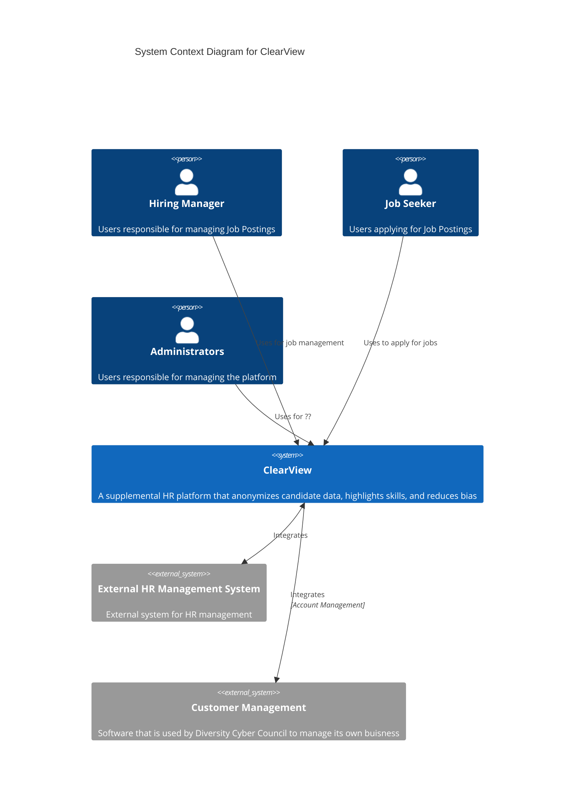

```mermaid
 C4Context
    title System Context Diagram for ClearView
    
    %% People interacting with the system
        Person(HM, "Hiring Manager", "Users responsible for managing Job Postings")
        Person(JS, "Job Seeker", "Users applying for Job Postings")
        Person(Admin, "Administrators", "Users responsible for managing the platform")

        %% The main system
        System(ClearView, "ClearView", "A supplemental HR platform that anonymizes candidate data, highlights skills, and reduces bias")
        
        %% External system
        System_Ext(ExternalHR, "External HR Management System", "External system for HR management")
        System_Ext(CRM, "Customer Management", "Software that is used by Diversity Cyber Council to manage its own buisness")
    
    %% Relationships between people and the system
    Rel(HM, ClearView, "Uses for job management")
    Rel(JS, ClearView, "Uses to apply for jobs")
    Rel(Admin, ClearView, "Uses for ??")
    BiRel(ClearView, ExternalHR, "Integrates")
    Rel(ClearView, CRM, "Integrates", "Account Management")
```

