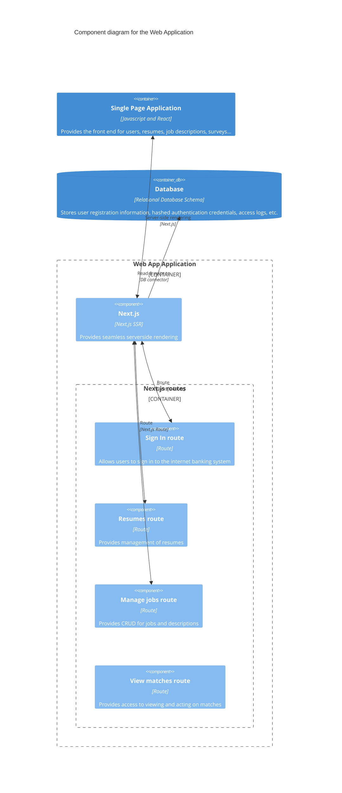

# C3: Web Application

```mermaid
    C4Component
    title Component diagram for the Web Application

    Container(spa, "Single Page Application", "Javascript and React", "Provides the front end for users, resumes, job descriptions, surveys...")
    ContainerDb(db, "Database", "Relational Database Schema", "Stores user registration information, hashed authentication credentials, access logs, etc.")

    Container_Boundary(api, "Web App Application") {
        Component(next, "Next.js", "Next.js SSR", "Provides seamless serverside rendering")

        Container_Boundary(nextjs, "Next.js routes") {
            Component(sign, "Sign In route", "Route", "Allows users to sign in to the internet banking system")
            Component(resumes, "Resumes route", "Route", "Provides management of resumes")
            Component(jobs, "Manage jobs route", "Route", "Provides CRUD for jobs and descriptions")
            Component(matches, "View matches route", "Route", "Provides access to viewing and acting on matches")
        }

        Rel(next, db, "Read & write to", "DB connector")
        UpdateRelStyle(next, db, $offsetX="-70", $offsetY="40")
    }

    BiRel(spa, next, "Server-side rendering", "Next.js")
    BiRel(next, sign, "Route", "Next.js Route")
    BiRel(next, resumes, "Route", "Next.js Route")
    BiRel(next, jobs, "")

    UpdateLayoutConfig($c4ShapeInRow="4", $c4BoundaryInRow="1")

```