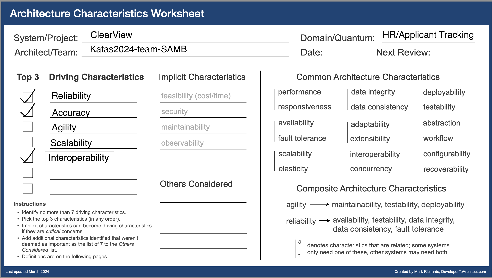

## Context
Diversity Cyber Council (https://www.diversitycybercouncil.com/) is a 501c3 Non-Profit that serves under-represented demographics in the tech industry. They would like to enhance diversity and inclusion by facilitating education, training, and staffing opportunities to underrepresented demographics.

## Problem Statement
Diversity Cyber council wants to build ClearView, a HR platform that performs bias-free matching of candidate resumes with potential Employers. Additionally, it will have capabilities for data/metrics collection, aggregation and reporting.  It will also  integrate with external HR systems.

## Definitions, Acronyms, and Abbreviations
| Term | Definition |
| ---- | ---------- |
| DEI | Diversity, Equity, and Inclusion |
| ATS | Applicant Tracking System |

## System Context
TODO - Add context Diagram here

The system aims to serve the following user Journeys
### Hiring Manager User Journey
- A Hiring Manager registers themselves on the site.
- They register the employer on the platform. An AI can assist them with completing the profile of the employer.
- They can manage job roles i.e. Create, edit,update and delete job roles.
- Review AI-generated anonymized profiles for candidates with their match scores for a given role.
- Unlock full candidate profiles by completing a payment.
- Select a candidate for follow up.
- Submit survey about a candidate and view survey results by candidates.
- View Job Role and Employer specific aggregate metrics.

### 7.2 Candidate User Journey
- A Candidate registers themselves on the site.
- They manage their personal profile - demographic details/contact information and their resume. An AI assists with improving their resume.
- The Candidate them marks themselves as active and an AI converts the profile and resume into an anonymized profile in SMART format.
- View the roles that have expressed interest in them.
- Follow up with hiring Manager for the role (outside the ClearView app)
- Mark themselves as inactive if hired.
- Submit a survey about the role and interviewer.

## TODO - Requirements
### Functional 
TODO - Add key capabilties
TODO - Review and add distilledRequirements here. 
### Architectural Characteristics

TODO - Add a blurb of text as to why we chose this ? 

## TODO - Assumptions
- The platform relies on the availability of APIs from HR systems for integration.
- The Admin user is part of the Employer similar to a hiring manager. 

## TODO - Solution
TODO - Add Logical model diagram and explain
TODO - Add Component diagram and explain

## Architectural Style

## References
- [Requirements](https://docs.google.com/document/d/1jCHMAvgzqaYaAp09br12OC4ozpVXZR3s9ezgEqncZ9U/edit#heading=h.xvbdsi1e8ttg)
- [Presentation Slides](https://on24static.akamaized.net/event/46/37/41/6/rt/1/documents/resourceList1726751953205/todayskatasslides1726751953205.pdf)
- [C4 Model](https://c4model.com/)