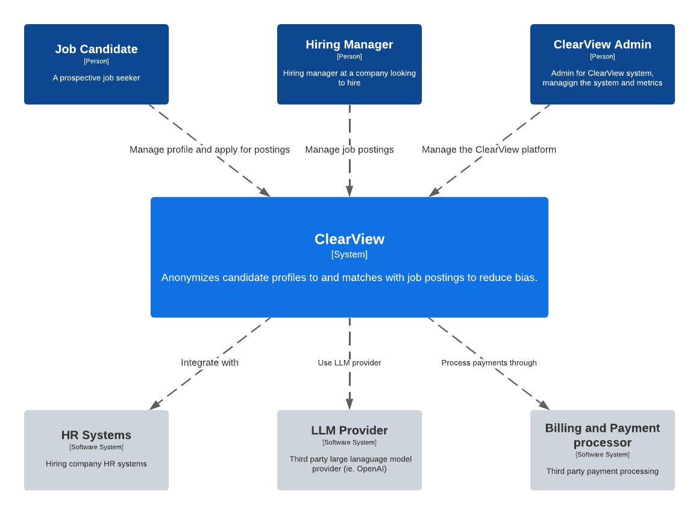
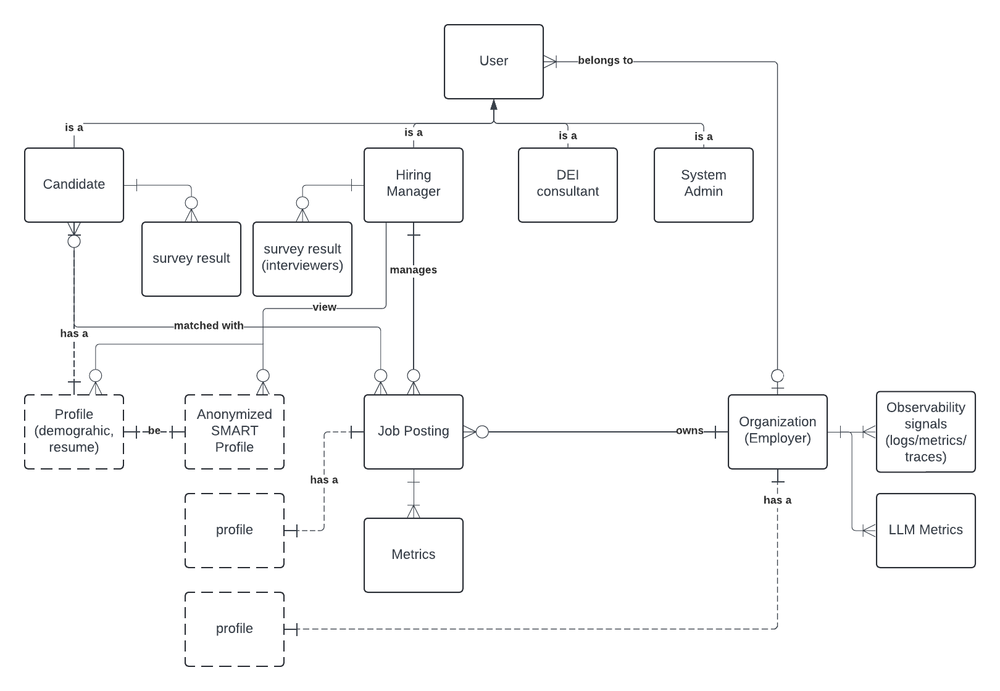
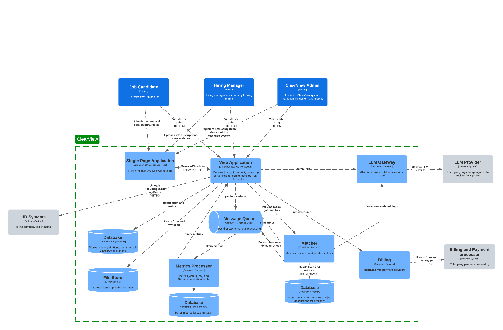
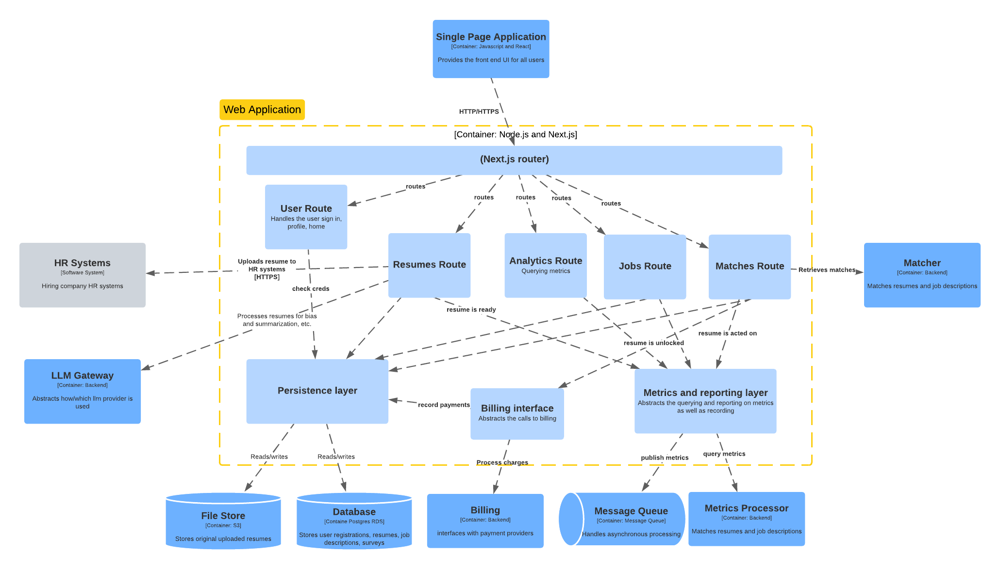
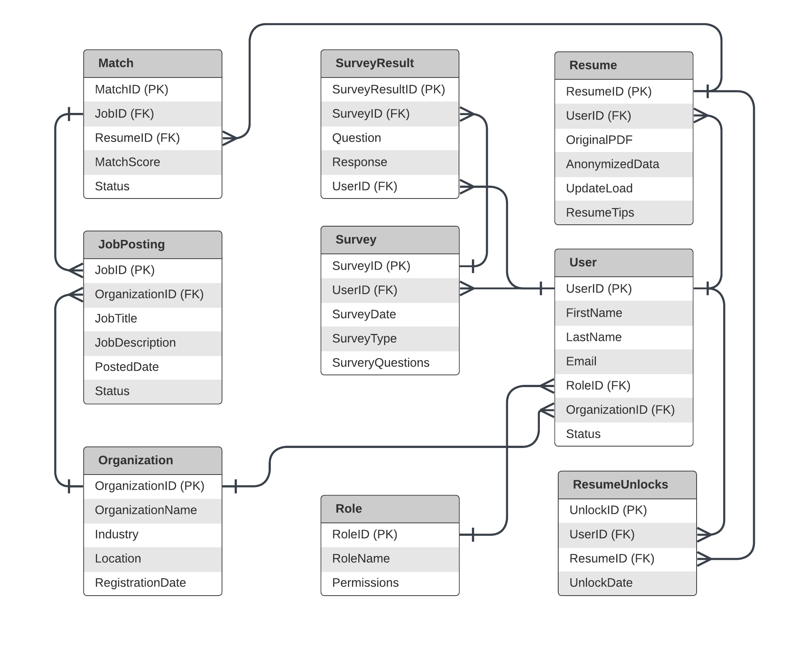
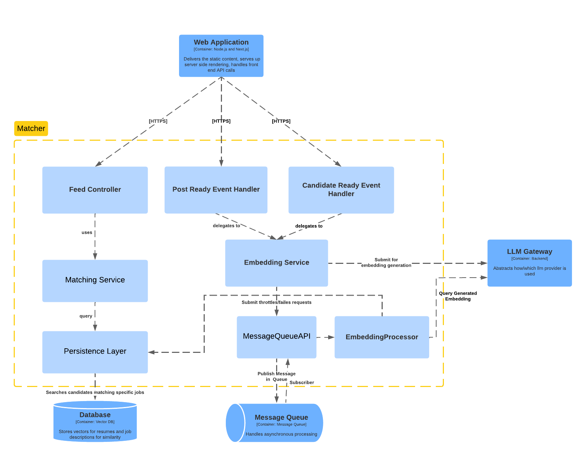
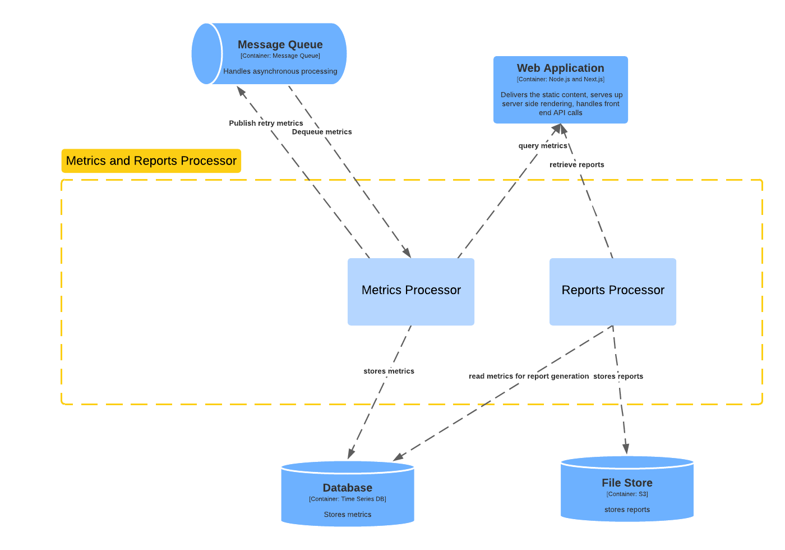
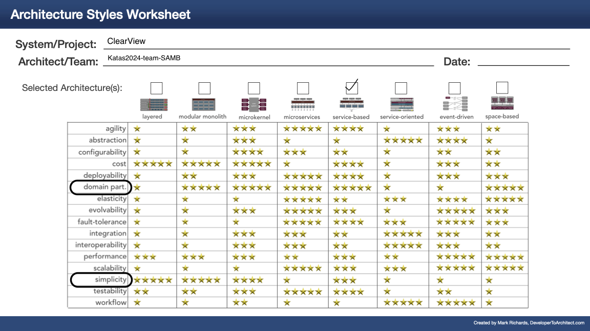

## Context

Diversity Cyber Council (https://www.diversitycybercouncil.com/) is a 501c3 Non-Profit that serves under-represented demographics in the tech industry. They would like to enhance diversity and inclusion by facilitating education, training, and staffing opportunities to underrepresented demographics.

## Problem Statement

Diversity Cyber council wants to build ClearView, a HR platform that performs bias-free matching of candidate resumes with potential Employers. Additionally, it will have capabilities for data/metrics collection, aggregation and reporting. It will also integrate with external HR systems.

## Definitions, Acronyms, and Abbreviations

| Term       | Definition                        |
| ---------- | --------------------------------- |
| DEI        | Diversity, Equity, and Inclusion  |
| ATS        | Applicant Tracking System         |
| LLM        | Large Language Model              |
| HR         | Human Resource                    |
| KPI        | Key Performance Indicator         |
| CNCF       | Cloud Native Computing Foundation |
| Anonymized | Bias is removed                   |

## System Context

We will use C4 for most of the diagamrs to describe the system. [ADR-Architectural-Design-Format](./ADRs/ADR-Architectural-Design-Format.md)

The system aims to serve the following user journeys:

### Hiring Manager User Journey

- A Hiring Manager registers themselves on the site.
- They register the employer on the platform. An AI can assist them with completing the profile of the employer.
- They can manage job postings i.e. Create, edit,update and delete job postings.
- They can:
  - Review AI-generated anonymized profiles for candidates with their match scores for a given role.
  - Unlock full candidate profiles by completing a payment.
  - Select a candidate for follow up.
  - Submit survey about a candidate and view survey results by candidates.
  - View Job Role and Employer specific aggregate metrics.

### Candidate User Journey

- A Candidate registers themselves on the site.
- They manage their personal profile - demographic details/contact information and their resume. An AI assists with improving their resume.
- The Candidate then marks themselves as active and an AI converts the profile and resume into an anonymized profile in SMART format.
- They can:
  - View the posting that have expressed interest in them.
  - Follow up with hiring Manager for the role (outside the ClearView app)
  - Mark themselves as inactive if hired.
  - Submit a survey about the role and interviewer.

### Admin User Journey

There are 2 types of Admin users in the system. An Admin that belongs to the Employer Organization and an Admin that belongs to the ClearView Organizations. Their journeys could therefore differ.
Employer Admins can :

- perform all tasks that a Hiring Manager can do (see above)
- Generate reports across all job postings within their Organization.
  ClearView Admins can:
- Generate reports across all Employer Organizations for evaluating if ClearView is meeting its Product KPIs.
- Manage an Employer or a Candidate.

## Requirements

### Functional

The following is a list of distilled requirements

- **REQ1**: Candidate must be able to create a profile by providing demographic, contact, and resume information.
- **REQ2**: Candidate can upload and update their resume in the system, and receive AI-generated tips and feedback to improve it.
- **REQ3**: Candidate must be able to view the number of employer interactions (e.g., profile views, expressions of interest).
- **REQ4**: Candidate must be able to mark themselves as inactive when hired.
- **REQ5**: Hiring Manager/Employer Admin must be able to create a company profile through AI-assisted autofill.
- **REQ6**: Hiring Manager/Employer Admin can post job descriptions, edit, and delete open roles in the system.
- **REQ7**: Hiring Manager/Employer Admin must be able to view anonymized candidate profiles with AI-generated summaries (SMART format) and match scores.
- **REQ8**: Hiring Manager/Employer Admin must be able to pay to unlock full candidate profiles (with demographic and PII data).
- **REQ9**: Hiring Manager/Employer Admin can request survey feedback from candidates after interviews.
- **REQ10**: Employer Admin must be able to access analytic reports on hiring metrics, including diversity and DEI performance.
- **REQ11**: ClearView Admins can manage Organizations(Employer), users, generate and schedule out-of-the-box reports on KPIs such as hiring rates, diversity trends, and performance against DEI goals.
- **REQ12**: Employer Admins can manage users within their Organization, API integrations, and data retention policies.

### Architectural Characteristics

We chose Reliability (Composite of availability, testability, data integrity, data consistency, fault tolerance), Accuracy, and Simplicity as the driving architectural characteristics.

- Reliability - Any cloud based software system must be available even when faults occur. Data integrity and consistency is key for any system that remembers/stores data. Testability is important for high quality and frequent software delivery.
- Accuracy - LLM models can hallucinate (i.e. give incorrect answers). It is important for the LLM to NOT omit key pieces of information when creating the SMART summaries. Additionally, it MUST remove bias factors from the anonymized candidate profiles.
- Simplicity - We want the system to be simple to develop, and operate and yet extensible as the scale comes.

## Assumptions
- ClearView System controls what it treats as biasing factors. Employers can not choose/customize the factors for them.
- The platform relies on the public APIs/SDKs from HR systems for integration.
- There are two kinds of admin users:
  - Admin for an employer: Has access to the data/metric/reports within the employer it belongs to.
  - Admin for clear view: Has access to the data/metric/reports across all the employers.
- The Hiring manager is also the interviewer for the purposes of surveys.
- The System caters to the US market and runs in a hosted cloud provider like AWS.
- Employers can sign up themselves.
  - A ClearView admin will review and approve employers registration requests.
-  Candidates can sign up individuals. 
  - Clearview system should be able to automatically verify candidates via One Time Password.
- The resume should be in a text-based PDF format using UTF-8 encoding.
  
## Solution

We propose a comprehensive design for the ClearView system that meets all specified requirements. The solution involves building a web application that manages the presentation, business logic, and data persistence layers. Key features, such as AI, storage, billing, and identity verification, will be outsourced to reliable, best-in-class external services, allowing us to focus on developing core ClearView functionalities in-house. The system will leverage modern, scalable technologies, including Next.js for frontend and backend development and cloud-based services for hosting and data management. Integration with popular HR platforms will be facilitated via standard REST APIs, ensuring seamless interoperability and future scalability.

### Logical Model

Here is a logical model of the system that explores key entities (a logical entity and not necessarily one from database parlance) and their relationships that need to be remembered to inform APIs and data models.

**Note:** Some relationships adopt crow's foot notation just for clarity's sake.

**Note:** Some elements in the diagram may just be key attributes of an entity. Example: a profile is a key attribute of a Candidate.

**Note:** Not all relationships need to be remembered by the system.

- The system has multiple users with different roles - Candidate, Hiring Manager, DEI consultant, System Admin.
- A user can optionally belong to an Organization.
  - A Hiring manager will belong to an Organization(Employer).
  - A DEI consultant may belong to an Organization.
  - A Candidate and an Admin don't necessarily belong to an employer but may be part of an internal Organization(for ex. ClearView)
  - An Admin can also be an admin of an Organization(like the Hiring Manager)
- A Hiring Manger manages a job posting that is owned by an Employer
- A Candidate is matched with a Job Posting.
- A Candidate, job posting and employer each have profiles. Profiles can be private ( but viewable to a Hiring Manager post payments ) or public(anonymized view of the private profile)
- A candidate owns the survey results posted by Hiring Managers.
- A Hiring Manager owns the survey results posted by Candidates.
- Metrics are collected pertaining to a particular job posting for ex. candidate acceptance/rejection, candidate unlocks.
- Observability signals are collected for System maintainability.
- LLM Metrics are collected to ensure the Accuracy of the external LLM system.

### C2: Container Diagram

- **User Personas: Job Candidate, Hiring Manager, ClearView Admin** – These are the primary user roles in ClearView, each with a unique profile upon registration.

- **Single-Page Application (SPA)** – A React-based JavaScript app that delivers a seamless front-end experience for ClearView users, providing fast and responsive interactions.

- **Web Application** – A Next.js (Node.js) application that handles static content, server-side processing, and acts as the backend for API requests. It encapsulates most of the business logic, managing resumes, jobs, user accounts, matches, and more.

- **LLM Gateway** – A standard interface for connecting to external AI providers, allowing for flexibility in changing or upgrading AI models and services.

- **LLM Provider** – An external or internal large language model (AI) service used for tasks like resume analysis, matching, and recommendation generation.

- **HR Systems Integration** – Interfaces with external HR systems like Workday to upload matched resumes for hiring companies.

- **Message Queue** – A publish/subscribe mechanism that enables asynchronous task processing for scalability and system efficiency.

- **Relational Database** – An ACID-compliant data store that houses core data, including user profiles, resumes, organizations, and survey results.

- **Matcher Engine** – A search and matching engine that compares anonymized resumes to job descriptions using a vector database for efficient similarity scoring.

- **File Store** – A repository for storing non-relational data like PDF resumes and other file-based content, supporting large binary objects (BLOBs).

- **Metrics Processor** – Manages system metrics, reports, and performance data, leveraging a time-series database for optimized processing, querying, and aggregation of historical data.

- **Billing System** – Handles payment workflows for unlocking resumes, with billing and payment processing services provided by an external vendor.

### Application

#### C3: Web Application

The C3 component diagram for the Next.js web application is as follows:

Aspects of this application:

- **Next.js router** - this is the server-side routing of requests into the Node.js server. Next.js has file-based routing that will be used.
- **Routes** - routes contain the UI components and business logic for the particular route.
  - **Resumes route** - this handles all requests related to resumes: uploading, managing, viewing as well as summarizing and viewing suggestions.
    - Resumes are uploaded via this route, parsing them using open source to convert them to text.
    - For the user to see an anonymized version of their resume in SMART format, the LLM gateway is called. We need to send an appropriate prompt to do this. The user does not modify the prompt, they only modify their resume. The result of the call to the LLM is persisted to the database through the persistence layer.
    - The candidate marks themselves (and their resume) as "active" and the resume is marked as "active" in the database. This triggers the [Matcher](#matcher) service for further processing (vectorization).
  - **Sign in route** - handles the authentication-specific requests for establishing user sessions. This also handles password resets and other user registration issues.
  - **Metrics route** - handles viewing and analyzing various metrics about ClearView.
  - **Billing route** - handles everything relating to billing and charging customers for resumes.
  - **Matches route** - exposes the ability to query matches for job descriptions and resumes.
    - This queries the [matcher](#matcher) service.
  - **Jobs route** - handles requests about jobs and descriptions. This allows CRUD on job descriptions.
- **Persistence layer** - abstracts persistence to database/file store.
- **Metrics layer** - abstracts persistence and querying of metrics.

##### Related ADRs:

- [ADR-Web-Application-Stack](ADRs/ADR-Web-Application-Stack.md)
- [ADR-External-LLM](ADRs/ADR-External-LLM.md)

#### C3: Relational Database

### Matcher

#### C3: Matcher Component
The Matcher is a component responsible for generating candidate matches based on anonymized profiles and job data provided by the application.
It can further be broken on below components:

- **Feed Controller** - exposes internal APIs that can be used to query feed(i.e. matching candidates).
- **Post Ready Event Handler** - exposes internal APIs that can be used ingest jobs that are ready to be matched.
- **Candidate Ready Event Handler** - exposes internal APIs that can be used to ingest "Smart Resumes" that are ready to be matched.
- **Embedding Service** - abstracts away complexity of choosing the right model and algorithm that is needed for
  embedding generation for the given use case.
- **Matching Service** - Responsible to generate feed by performing vector based matching by using capabilities provided
  by persistence layer.
- **Embedding Processor** - Queries generated embeddings from external llm provider via llm gateway after a delay
  and stores them in vector db when embeddings are available.
- **Persistence Layer** - Provide abstraction over specific vector db provider/implementation.
- **Message Queue API** - Provides abstraction over specific message queue implementation/choice.
  - Provides API to publish a message(optionally with a delay)
  - Register a message type
  - Provides API to define **Runnables** that should be executed when the message is delivered.

##### Related ADRs

- [Use Message Queue for Asynchronous Workflows in ClearView](./ADRs/ADR-Use-of-message-queues-for-asynchrounous-execution.md)
- [Use Pinecone as a Vector Database](./ADRs/ADR-Use-of-Pinecone-as-vector-db.md)

#### C3: Vector Database
Every Job Posting Id and Resume Id and their respective embeddings would each be represented by a vector in the database.
Additionally, Each Vector would have additional attributes:
 - **vectorType** : candidate or job

Most vector databases support euclidean, cosine and dotproduct. The selection of most efficient algorithms would require 
running experiments on real data via some sort of canary in the matcher.  

### Metrics

We need to collect metrics based on certain events within the system to be able to generate aggregate dashboards for the Candidates, and Employers, and ClearView Admins.

The key events and their respective attributes are as follows

- Unlock Candidate (Hiring manger making a payment ot unlock a candidate)
  - `timestamp`
  - `candidateId`
  - `candidateName`
  - `hiringManagerId`
  - `hiringManagerName`
  - `jobPostingId`
  - `jobTitle`
  - `employerId`
  - `employerName`
- Select Candidate (Hiring manager selecting a candidate for pursuing)
  - `timestamp`
  - `candidateId`
  - `candidateName`
  - `hiringManagerId`
  - `hiringManagerName`
  - `jobPostingId`
  - `jobTitle`
  - `employerId`
  - `employerName`
- Confirm Candidate (Hiring manager confirming a candidate as hired)
  - `timestamp`
  - `candidateId`
  - `candidateName`
  - `hiringManagerId`
  - `hiringManagerName`
  - `jobPostingId`
  - `jobTitle`
  - `employerId`
  - `employerName`
  - `<demographic attirbutes>(see below)`
- Reject Candidate (Hiring manager rejecting a candidate)
  - `timestamp`
  - `candidateId`
  - `candidateName`
  - `hiringManagerId`
  - `hiringManagerName`
  - `jobPostingId`
  - `jobTitle`
  - `employerId`
  - `employerName`
  - `<demographic attirbutes>(see below)`

Key Demographic attributes

- `candidateGender` - Male, female, non-binary.
- `candidateEdLevel` - High school, bachelor's degree, master's degree, etc.
- `candidateOccupation` - Job titles, industries, or employment status.
- `candidateLocation` - Country, state, city, or specific regions.
- `candidateRace` - Various ethnic or racial backgrounds.
- `candidateLanguage` - Primary language spoken.

The key thing to note in all the above metrics is that they're all captured when a Candidate's status changes(i.e. unlock , select , confirm, or reject candidate) and these all happen when an Employer(Hiring manger/Admin) use the web application (aka api calls as part of the system).

The write patterns are a function of the frequency at which hiring managers evaluate candidates for positions and the time involved in completing the interview process (not in scope of ClearView). The write patterns will likely be infrequent.

The read patterns are again a function of Employer Admins reviewing these metrics. We assume that this is also not super frequent. There is however a regular cadence of the monthly report generation.

#### C3 : Metrics Processor Component

The C3 component diagram for the metrics component is as follows:

It would be web applications responsibility to enqueue events whenever a candidate's state changes. We re-use the message queue for the sake of simplicity(order of the events does not matter).

- The Message Processor would be responsible for draining these metrics from the queue and persisting them in a time series db.
- The Reports Processor is a component that generates that queries the time series db and generates reports at a system configured frequency and stores them in the file store. It also serves the reports to the web application whenever there are api calls.

#### C3: Metrics Database

All the metrics above could be stored in a single measurement table.

Additionally, it's important for the source(i.e. Web Application) to generate the metric id so that the metrics processor can de-dupe them effectively.

[metrics-ER-diagram](./resources/metrics-ER-diagram.png)

### Observability and Application Performance Management

Internal Observability signals like logs, traces, metrics are critical for ensuring reliability and availability of the service.
Additionally, we need a reliable way to store, visualize, and alert on these metrics. The following pieces of technology provide a comprehensive observability stack.

Open Telemetry - [ADR-OpenTelemetry-for-observability](./ADRs/ADR-OpenTelemetry-for-observability.md) - Open Telemetry a CNCF project and pretty much the de-facto standard for collecting and transporting observability signals from the infrastructure layer all the way up to the application layer.

Elastic Observability - [ADR-Elastic-for-observability](./ADRs/ADR-Elastic-for-observability.md)Elastic provides comprehensive set of tools for storing, searching and visualizing observability signals. It is compatible with Open Telemetry.

PagerDuty - PagerDuty is pretty much the de-facto standard for building an alert based notification system for ensuring timely and proactive responses to operational issues.

## Architectural Style

We chose simplicity, reliability and accuracy in the [architectural characteristics](#architectural-characteristics). Service-based architecture seemed the best solution while maintaining some level of simplicity. By choosing Next.js for the front end and web [application](#application), this fits with a simple experience. We then have supporting services and databases utilized by the Next.js backend. This also gives us some flexibility later to extract out any logic that starts to get complex into their own supporting services.

## Conclusion

We believe our solution is simple to implement and is optimized for going to market in a relatively short timeframe.
It has enough modularity that things can be pulled out into separate services if required.

While we didn't talk about a deployment model in detail, we envision this solution being implemented and deployed in a Kubernetes environment using managed services from AWS. Therefore, horizontal and vertical scaling should be possible to do with minimal effort.

## References

- [Requirements](https://docs.google.com/document/d/1jCHMAvgzqaYaAp09br12OC4ozpVXZR3s9ezgEqncZ9U/edit#heading=h.xvbdsi1e8ttg)
- [Presentation Slides](https://on24static.akamaized.net/event/46/37/41/6/rt/1/documents/resourceList1726751953205/todayskatasslides1726751953205.pdf)
- [C4 Model](https://c4model.com/)
