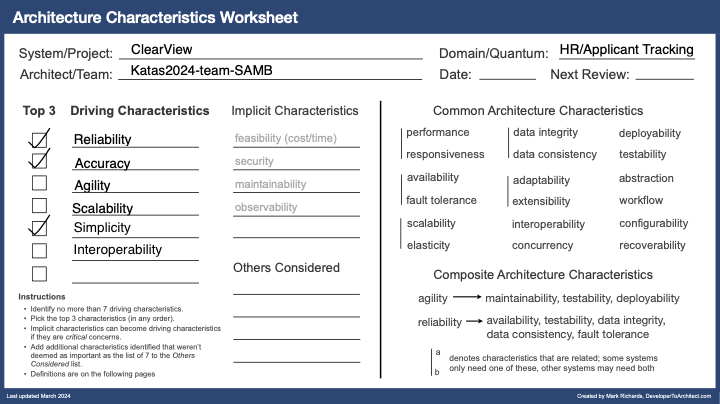

## Context
Diversity Cyber Council (https://www.diversitycybercouncil.com/) is a 501c3 Non-Profit that serves under-represented demographics in the tech industry. They would like to enhance diversity and inclusion by facilitating education, training, and staffing opportunities to underrepresented demographics.

## Problem Statement
Diversity Cyber council wants to build ClearView, a HR platform that performs bias-free matching of candidate resumes with potential Employers. Additionally, it will have capabilities for data/metrics collection, aggregation and reporting.  It will also  integrate with external HR systems.

## Definitions, Acronyms, and Abbreviations
| Term | Definition                       |
|------|----------------------------------|
| DEI  | Diversity, Equity, and Inclusion |
| ATS  | Applicant Tracking System        |
| LLM  | Large Language Model             |
| HR   | Human Resource                   |
| KPI  | Key Performance Indicator        |

## System Context

The system aims to serve the following user journeys:

### Hiring Manager User Journey
- A Hiring Manager registers themselves on the site.
- They register the employer on the platform. An AI can assist them with completing the profile of the employer.
- They can manage job postings i.e. Create, edit,update and delete job postings.
- They can:
  - Review AI-generated anonymized profiles for candidates with their match scores for a given role.
  - Unlock full candidate profiles by completing a payment.
  - Select a candidate for follow up.
  - Submit survey about a candidate and view survey results by candidates.
  - View Job Role and Employer specific aggregate metrics.

### Candidate User Journey
- A Candidate registers themselves on the site.
- They manage their personal profile - demographic details/contact information and their resume. An AI assists with improving their resume.
- The Candidate then marks themselves as active and an AI converts the profile and resume into an anonymized profile in SMART format.
- They can:
  - View the posting that have expressed interest in them.
  - Follow up with hiring Manager for the role (outside the ClearView app)
  - Mark themselves as inactive if hired.
  - Submit a survey about the role and interviewer.

### Admin User Journey
There are 2 types of Admin users in the system. An Admin that belongs to the Employer Organization and an Admin that belongs to the ClearView Organizations. Their journeys could therefore differ.
Employer Admins can : 
- perform all tasks that a Hiring Manager can do (see above)
- Generate reports across all job postings within their Organization.
ClearView Admins can:
- Generate reports across all Employer Organizations for evaluating if ClearView is meeting its Product KPIs.
- Manage an Employer or a Candidate.

## Requirements
### Functional 
The following is a list of distilled requirements
- **REQ1**: Candidate must be able to create a profile by providing demographic, contact, and resume information.
- **REQ2**: Candidate can upload and update their resume in the system, and receive AI-generated tips and feedback to improve it.
- **REQ3**: Candidate must be able to view the number of employer interactions (e.g., profile views, expressions of interest).
- **REQ4**: Candidate must be able to mark themselves as inactive when hired.
- **REQ5**: Hiring Manager/Employer Admin must be able to create a company profile through AI-assisted autofill.
- **REQ6**: Hiring Manager/Employer Admin can post job descriptions, edit, and delete open roles in the system.
- **REQ7**: Hiring Manager/Employer Admin must be able to view anonymized candidate profiles with AI-generated summaries (SMART format) and match scores.
- **REQ8**: Hiring Manager/Employer Admin must be able to pay to unlock full candidate profiles (with demographic and PII data).
- **REQ9**: Hiring Manager/Employer Admin can request survey feedback from candidates after interviews.
- **REQ10**: Employer Admin must be able to access analytic reports on hiring metrics, including diversity and DEI performance.
- **REQ11**: ClearView Admins can manage Organizations(Employer), users, generate and schedule out-of-the-box reports on KPIs such as hiring rates, diversity trends, and performance against DEI goals.
- **REQ12**: Employer Admins can manage users within their Organization, API integrations, and data retention policies.

### Architectural Characteristics

We chose Accuracy, Interoperability and Reliability (Composite of availability, testability, data integrity, data consistency, fault tolerance) as the driving architectural characteristics.
- Reliability - Any cloud based software system must be available even when faults occur. Data integrity and consistency is key for any system that remembers/stores data. Testability is important for high quality and frequent software delivery.  
- Accuracy - LLM models can hallucinate (i.e. give incorrect answers). It is important for the LLM to NOT omit key pieces of information when creating the SMART summaries. Additionally, it MUST remove bias factors from the anonymized candidate profiles.  
- Interoperability - Given that this is a supplemental HR system, we want the components to be API driven so that connectivity and data transfer can be achieved in a standardized way with external HR systems. Additionally, intra system communication.

## TODO - Assumptions
- The platform relies on the availability of APIs from HR systems for integration.
- The Admin user is part of the Employer similar to a hiring manager. 
- The Hiring manager is also the interviewer for the purposes of surveys.
- The System caters to the US market and runs in a hosted cloud provider like AWS.

## WIP - Solution
### Logical Model
Here is a logical model of the system that explores key entities (a logical entity and not necessarily one from database parlance) and their relationships that need to be remembered to inform APIs and data models.

**Note:** Some relationships adopt crow's foot notation just for clarity's sake.

**Note:** Some elements in the diagram may just be key attributes of an entity. Example: a profile is a key attribute of a Candidate.

**Note:** Not all relationships need to be remembered by the system.

- The system has multiple users with different roles - Candidate, Hiring Manager, DEI consultant, System Admin. 
- A user can optionally belong to an Organization. 
    - A Hiring manager will belong to an Organization(Employer). 
    - A DEI consultant may belong to an Organization.
    - A Candidate and an Admin don't necessarily belong to an employer but may be part of an internal Organization(for ex. ClearView)
    - An Admin can also be an admin of an Organization(like the Hiring Manager)
- A Hiring Manger manages a job posting that is owned by an Employer
- A Candidate is matched with a Job Posting. 
- A Candidate, job posting and employer each have profiles. Profiles can be private ( but viewable to a Hiring Manager post payments ) or public(anonymized view of the private profile)
- A candidate owns the survey results posted by Hiring Managers.
- A Hiring Manager owns the survey results posted by Candidates.
- Metrics are collected pertaining to a particular job posting for ex. candidate acceptance/rejection, candidate unlocks. 
- Observability signals are collected for System maintainability.
- LLM Metrics are collected to ensure the Accuracy of the external LLM system.

## Architectural Style
TODO: Reference https://www.developertoarchitect.com/downloads/architecture-styles-worksheet.pdf and our priorities and state where we landed

## References
- [Requirements](https://docs.google.com/document/d/1jCHMAvgzqaYaAp09br12OC4ozpVXZR3s9ezgEqncZ9U/edit#heading=h.xvbdsi1e8ttg)
- [Presentation Slides](https://on24static.akamaized.net/event/46/37/41/6/rt/1/documents/resourceList1726751953205/todayskatasslides1726751953205.pdf)
- [C4 Model](https://c4model.com/)